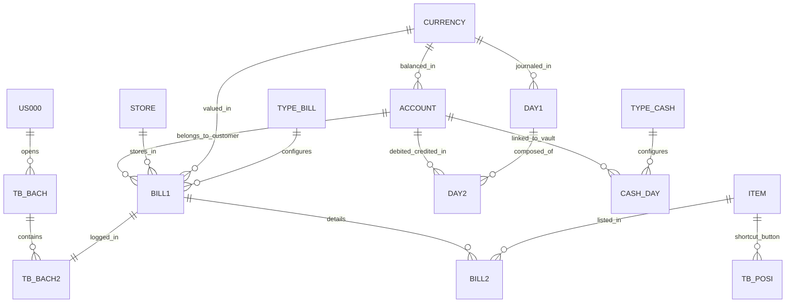

# توثيق معمارية النظام وتصميم قاعدة البيانات (MgaSoftAccounts)

يحتوي هذا المستند على شرح تقني وتفصيلي شامل لنظام إدارة الحسابات ونقاط البيع **MgaSoftAccounts**، بهدف تمكين أي مطور برمجيات من فهم النظام وإعادة بنائه أو استنساخه بالكامل.

---

## 1. المعمارية التقنية للبرنامج (System Architecture)

يعتمد النظام الحالي على التصميم التقليدي للتطبيقات المكتبية ثنائية الطبقات (2-Tier Desktop Application):

*   **بيئة التطوير وإطار العمل**: المبيّت على `VB.NET` مع `.NET Framework 4.7.2` (تطبيق Windows Forms).
*   **قاعدة البيانات**: خادم `Microsoft SQL Server`.
*   **الربط والاتصال (Data Access Layer)**:
    *   الاتصال المباشر بقاعدة البيانات عبر الكلاس `SqlConnection` في فضاء الأسماء `System.Data.SqlClient`.
    *   يتم قراءة نص الاتصال بالخادم وقاعدة البيانات من ملف نصي محلي يُسمى `CONN.dll` موجود بجوار الملف التنفيذي للبرنامج.
    *   يعتمد النظام بشكل كامل على **الإجراءات المخزنة (Stored Procedures)** لتنفيذ عمليات الإضافة والتعديل والبحث، مما يرفع من مستوى الأمان وسرعة معالجة البيانات على الخادم.
    *   يتم استخدام مكتبات **SMO (SQL Server Management Objects)** للقيام بمهام الصيانة وإجراء النسخ الاحتياطي (`Backup`) واسترجاع قاعدة البيانات (`Restore`) من Master.
*   **تصميم الواجهات (Presentation Layer)**:
    *   استخدام حزم ومكتبات خارجية مثل `Bunifu Animator` و `CTSkinet` لتأمين حركات انزلاقية وثنائية الأبعاد، وتخصيص مظاهر الأدوات البرمجية (أزرار، حقول إدخال، قائمة شجرية) لتظهر بتصميم عصري وجذاب.

---

## 2. المخطط الهيكلي لقاعدة البيانات (Entity Relationship Diagram - ERD)

يوضح المخطط التالي العلاقات والترابط بين الجداول الأساسية في النظام محاسبياً وتشغيلياً:



---

## 3. تفاصيل الجداول والأعمدة والروابط المحورية

تعتمد قاعدة البيانات على حقول المعرفات الفريدة (`GUID`) من نوع النص (`NVarChar(500)`) أو المعرف الفريد الفريد (`Uniqueidentifier`) لربط السجلات معاً لسهولة المزامنة مستقبلاً ومنع تكرار المفاتيح الأساسية.

### 2.1 شجرة الحسابات (جدول `ACCOUNT`)
يخزن الدليل المحاسبي للشركة بالكامل (الأصول، الخصوم، حقوق الملكية، الإيرادات، المصاريف).

| اسم الحقل | نوع البيانات | الوصف والروابط |
| :--- | :--- | :--- |
| `GUID` | `NVarChar(500)` | المفتاح الأساسي (Primary Key). |
| `CODE` | `NVarChar(500)` | رمز الحساب المحاسبي (مثال: 1101 الصناديق). |
| `NAME` | `NVarChar(500)` | اسم الحساب (بالعربية). |
| `PARENT_GUID` | `NVarChar(500)` | يربط بالحقل `GUID` لنفس الجدول (علاقة ذاتية لتمثيل الهرمية - حساب أب). |
| `END_ACCOUNT` | `Float / Double` | الحساب الختامي الذي يرحل إليه (ميزانية عمومية، أرباح وخسائر، إلخ). |
| `GUID_CURRENCY` | `NVarChar(500)` | يربط بجدول العملات `CURRNECY.GUID`. |
| `MOBILE` | `NVarChar(500)` | رقم جوال صاحب الحساب (عميل أو مورد). |
| `FREEZ` | `Bit / Boolean` | لتجميد الحساب وإيقاف التعامل عليه (مفعل/معطل). |
| `TYPE` | `Int` | نوع الحساب (رئيسي لا يقبل الترحيل، فرعي يقبل الترحيل). |
| `DEBIT` | `Float` | القيمة الافتتاحية للمدين. |
| `CREDIT` | `Float` | القيمة الافتتاحية للدائن. |
| `APPLE` | `Bit` | خيارات تفعيلية خاصة بالحساب. |
| `DATEF` | `DateTime` | تاريخ بدء التعامل بالحساب. |
| `DATET` | `DateTime` | تاريخ انتهاء صلاحية التعامل بالحساب. |

---

### 2.2 جدول بطاقات المواد (`ITEM`)
يخزن تفاصيل السلع والمنتجات ومخزون المستودعات.

| اسم الحقل | نوع البيانات | الوصف والروابط |
| :--- | :--- | :--- |
| `GUID` | `NVarChar(500)` | المفتاح الأساسي (Primary Key). |
| `NUMBER` | `Int` | رقم المادة التسلسلي. |
| `NAME` | `NVarChar(500)` | اسم المادة (الصنف). |
| `NOTE` | `NVarChar(500)` | ملاحظات حول الصنف. |
| `GROUP_GUID` | `NVarChar(500)` | يربط بجدول تصنيفات المواد (الأب). |
| `barcode1` | `NVarChar(500)` | باركود الوحدة الأولى (الأصغر غالباً). |
| `UNITE1` | `NVarChar(500)` | اسم الوحدة الأولى (مثال: حبة). |
| `QTY1` | `Float` | معامل التحويل للوحدة الأولى (دائماً = 1). |
| `COST1` | `Float` | سعر التكلفة للوحدة الأولى. |
| `PRICE1` | `Float` | سعر البيع للوحدة الأولى. |
| `barcode2` | `NVarChar(500)` | باركود الوحدة الثانية. |
| `UNITE2` | `NVarChar(500)` | اسم الوحدة الثانية (مثال: علبة). |
| `QTY2` | `Float` | معامل التحويل بالنسبة للوحدة الأولى (مثال: 12 حبة). |
| `COST2` | `Float` | سعر التكلفة للوحدة الثانية. |
| `PRICE2` | `Float` | سعر البيع للوحدة الثانية. |
| `barcode3` | `NVarChar(500)` | باركود الوحدة الثالثة. |
| `UNITE3` | `NVarChar(500)` | اسم الوحدة الثالثة (مثال: كرتون). |
| `QTY3` | `Float` | معامل التحويل بالنسبة للوحدة الأولى (مثال: 120 حبة). |
| `COST3` | `Float` | سعر التكلفة للوحدة الثالثة. |
| `PRICE3` | `Float` | سعر البيع للوحدة الثالثة. |
| `DEFULT_UNITE` | `Int` | الوحدة الافتراضية للبيع (1، 2، أو 3). |
| `DATEP` | `DateTime` | تاريخ الإنتاج الافتراضي. |
| `DATEE` | `DateTime` | تاريخ انتهاء الصلاحية. |
| `DAY_MEPER` | `Int` | عدد الأيام للإنذار قبل انتهاء الصلاحية. |
| `QTY_MEPER` | `Float` | حد الطلب (أقل كمية مسموح بها في المخزن قبل التنبيه). |
| `FREEZ` | `Bit` | تجميد/إيقاف التعامل بالصنف. |
| `IMG` | `Image (Binary)` | صورة الصنف للظهور في شاشة الكاشير. |
| `GC` | `NVarChar(500)` | عملة الصنف (يربط بجدول العملات). |
| `VC` | `Float` | قيمة سعر الصرف المعتمد للصنف. |
| `CT_PER` | `Bit` | تفعيل حساب الضريبة المئوية للصنف. |
| `PER` | `Float` | نسبة ضريبة القيمة المضافة الخاصة بالمنتج (مثال: 15). |

---

### 2.3 جداول فواتير المبيعات والمشتريات (`BILL1` و `BILL2`)

#### جدول رأس الفاتورة (`BILL1`)
| اسم الحقل | نوع البيانات | الوصف والروابط |
| :--- | :--- | :--- |
| `GUID` | `NVarChar(500)` | المفتاح الأساسي. |
| `NUMBER` | `Int` | رقم الفاتورة التسلسلي. |
| `TYPE_NUMBER` | `Int` | نوع الفاتورة (مبيعات=1، مشتريات=2، مرتجع مبيعات=3، مرتجع مشتريات=4، إلخ). |
| `DATE` | `DateTime` | تاريخ ووقت تحرير الفاتورة. |
| `TYPE_PAY` | `Int` | طريقة الدفع (0 نقدي، 1 آجل، 2 شبكة/شيك). |
| `CUST` | `NVarChar(500)` | اسم العميل/المورد (للفواتير السريعة أو النقدية). |
| `NOTE` | `NVarChar(500)` | بيان أو شرح عن الفاتورة. |
| `STORE_GUID` | `NVarChar(500)` | يربط بجدول المخازن (المستودع المخرج/المدخل للمواد). |
| `GUID_JOB` | `NVarChar(500)` | مركز التكلفة المرتبط بالفاتورة (يربط بجدول الوظائف/مراكز التكلفة). |
| `GUID_CURRENCY` | `NVarChar(500)` | العملة المستخدمة في الفاتورة. |
| `CURRENCY_VAL` | `Float` | سعر صرف العملة وقت الفاتورة. |
| `TOT_DIS` | `Float` | إجمالي الخصومات على الفاتورة. |
| `TOT_VAT` | `Float` | إجمالي ضريبة القيمة المضافة المحتسبة على الفاتورة. |
| `DIS` | `Float` | قيمة خصم إضافي مباشر على الفاتورة ككل. |
| `TOT_FINLY` | `Float` | المبلغ الصافي النهائي المطلوب سداده (بعد الخصم والضريبة). |
| `ACCOUNT` | `NVarChar(500)` | الحساب المالي المقابل للفاتورة (يربط بالحساب المالي للعميل/المورد في `ACCOUNT`). |
| `GUID_BIIL` | `NVarChar(500)` | يربط بنوع الفاتورة في جدول التهيئة `TYPE_BILL.GUID`. |
| `POS` | `Int` | يحدد ما إذا كانت الفاتورة منشأة عبر الكاشير السريع (0 = عادي، 1 = POS). |
| `WAIT` | `Bit / Int` | وضع الفاتورة في حالة "الانتظار" (تستخدم في الكاشير لحفظ الفاتورة الحالية واستدعائها لاحقاً). |
| `TOT_PAY` | `Float` | المبلغ المدفوع بالفعل من قبل الزبون. |
| `TOT_LEFT` | `Float` | المبلغ المتبقي على الزبون (المستحق للآجل). |

#### جدول تفاصيل الفاتورة (`BILL2`)
| اسم الحقل | نوع البيانات | الوصف والروابط |
| :--- | :--- | :--- |
| `PARENT_GUID` | `NVarChar(500)` | مفتاح أجنبي يربط بـ `BILL1.GUID` (علاقة رأس بأطراف One-to-Many). |
| `GUID_ITEM` | `NVarChar(500)` | يربط بجدول المواد `ITEM.GUID`. |
| `QTY` | `Float` | الكمية المباعة/المشتراة بالوحدة المحددة. |
| `PRICE` | `Float` | سعر بيع/شراء القطعة الواحدة من الوحدة المحددة. |
| `UNITE` | `NVarChar(500)` | اسم الوحدة المستخدمة في الفاتورة (حبة، كرتون، إلخ). |
| `QTY_UNITE` | `Float` | معامل تحويل الوحدة (لمعرفة إجمالي الكمية بالوحدة الأساسية لأغراض تقييم المخازن). |
| `COST` | `Float` | تكلفة المادة (يستخدم لحساب الأرباح والخسائر للمبيعات). |
| `EARN` | `Float` | صافي ربح السطر (السعر - التكلفة). |
| `DIS` | `Float` | الخصم الممنوح على هذا السطر المحدد. |
| `VAT` | `Float` | قيمة الضريبة المحتسبة على هذا السطر المحدد. |
| `TOTALS` | `Float` | إجمالي السطر الإجمالي (الكمية * السعر). |
| `TOTALS_FINLY` | `Float` | الصافي النهائي للسطر بعد الخصم وإضافة الضريبة. |

---

### 2.4 جداول قيود اليومية المحاسبية (`DAY1` و `DAY2`)

#### جدول رأس السند/القيد المحاسبي (`DAY1`)
| اسم الحقل | نوع البيانات | الوصف والروابط |
| :--- | :--- | :--- |
| `GUID` | `NVarChar(500)` | المفتاح الأساسي. |
| `TYPE_NUMBER` | `Int` | نوع السند (سند يومية عامة، سند ترحيل فاتورة، سند تسوية افتتاحية، إلخ). |
| `NUMBER` | `Int` | رقم السند المحاسبي. |
| `DATE` | `DateTime` | تاريخ التسجيل المالي. |
| `NOTE` | `NVarChar(500)` | شرح عام للقيد المحاسبي. |
| `TYPE` | `NVarChar(500)` | وصف إضافي للنوع. |
| `note_day` | `NVarChar(500)` | حقل ملاحظات إضافي. |
| `GUID_JOB` | `NVarChar(500)` | مركز التكلفة العام. |
| `GUID_CURRENCY` | `NVarChar(500)` | العملة المستخدمة في القيد المالي. |
| `CURRENCY_VAL` | `Float` | سعر صرف العملة. |

#### جدول أطراف القيد المحاسبي (`DAY2`)
| اسم الحقل | نوع البيانات | الوصف والروابط |
| :--- | :--- | :--- |
| `PARENT_GUID` | `NVarChar(500)` | يربط بـ `DAY1.GUID` (مفتاح أجنبي). |
| `ACCOUNT_GUID` | `NVarChar(500)` | يربط بالحساب المحاسبي المتأثر `ACCOUNT.GUID`. |
| `DEBIT` | `Float` | قيمة الطرف المدين (بالعملة المحددة). |
| `CREDIT` | `Float` | قيمة الطرف الدائن (بالعملة المحددة). |
| `NOTE` | `NVarChar(500)` | شرح تفصيلي خاص بالسطر. |
| `GUID_JOB` | `NVarChar(500)` | مركز التكلفة المرتبط بالسطر المحدد. |
| `GUID_CURRENCY` | `NVarChar(500)` | العملة. |
| `CURRENCY_VAL` | `Float` | سعر الصرف. |
| `VAL_LOCALY` | `Float` | القيمة المكافئة للعملة المحلية (مدين أو دائن مضروباً بسعر الصرف). |

---

### 2.5 جداول تهيئة المستندات وتثبيتها (`TYPE_BILL` و `TYPE_CASH`)
تسمح للمستخدم (المشرف) بتعريف فواتير وسندات لا حصر لها، مع توجيه محاسبي آلي لكل مستند.

#### جدول تهيئة أنواع الفواتير (`TYPE_BILL`)
*   يخزن قواعد إنشاء الفاتورة مثل: (مبيعات معرض، مبيعات جملة، مشتريات خارجية).
*   الحقول المهمة:
    *   `day_item`: الحساب المالي الذي يمثل حركة البضاعة (مثال: حساب المبيعات، أو حساب المشتريات).
    *   `day_disc`: حساب الخصم المرتبط (الخصم المكتسب أو الخصم المسموح به).
    *   `cash_day`: حساب الصندوق أو البنك الافتراضي الذي يستقبل المبالغ النقدية للفاتورة.
    *   `cash_vat`: حساب مصلحة الضرائب والزكاة المخصص لضريبة الفاتورة.
    *   `vat_activty` (Bit): تفعيل أو إلغاء الضريبة لهذه الفاتورة تلقائياً.
    *   `val_vat` (Float): نسبة الضريبة الافتراضية (مثال: 15%).
    *   `TYPE` (Bit): تحديد ما إذا كان هذا المستند سيعمل كنقاط بيع `POS` سريعة.

#### جدول تهيئة أنواع السندات (`TYPE_CASH`)
*   يخزن تهيئة سندات الصرف والقبض (مثال: سند قبض عملاء، سند صرف مصاريف كهرباء).
*   الحقول المهمة:
    *   `DAY_CASH`: الحساب الافتراضي المقابل للعملية (مثل صندوق المعرض الرئيسي) الذي تودع فيه أو تصرف منه الأموال.

---

### 2.6 جداول نظام الورديات ونقاط البيع (`TB_BACH`, `TB_BACH2`, `TB_POSES`, `TB_POSI`)

1.  **جدول الورديات (`TB_BACH`)**:
    *   يمثل الصندوق اليومي (الدرج/الوردية) المفتوح بواسطة كاشير محدد.
    *   الحقول: `GUID` (مفتاح أساسي)، `NUMBER` (رقم الوردية)، `DATE` (تاريخ الفتح)، `GUSER` (معرف المستخدم الكاشير `US000.GUID`)، و `CP` (حالة الوردية: 0 مفتوحة، 1 مغلقة).
2.  **جدول ربط الفواتير بالورديات (`TB_BACH2`)**:
    *   علاقة وسيطة لربط الفواتير بالوردية المفتوحة حالياً لأغراض الجرد ومطابقة الدرج.
    *   الحقول: `PARENTGUID` (يربط بـ `TB_BACH.GUID`)، و `GUID_BILL` (يربط بـ `BILL1.GUID`).
3.  **جدول أجهزة نقاط البيع الكاشير (`TB_POSES`)**:
    *   يخزن بيانات تعريف أجهزة الكاشير المتاحة في المتجر.
    *   الحقول: `GUID`، `NAME` (اسم الجهاز)، `GUID_USER` (الكاشير الافتراضي)، `GUID_SALE` (نوع فاتورة المبيعات المعتمدة)، `GUID_RSALE` (نوع فاتورة المرتجع المعتمدة)، `ACCOUNT_CASH` (حساب الصندوق الخاص بهذا الجهاز محاسبياً)، و `PRINTER` (اسم الطابعة الحرارية المعرفة بالويندوز).
4.  **جدول أزرار المواد السريعة للـ POS (`TB_POSI`)**:
    *   يحدد المواد التي تظهر كأزرار اختصار سريعة في شاشة الكاشير لسهولة النقر عليها.
    *   الحقول: `GUID`، `NAME` (الاسم الظاهر على الزر)، `GUIDI` (يربط بالصنف الأساسي `ITEM.GUID`)، `UNITE` (الوحدة الافتراضية)، `COLORB` (لون خلفية الزر لسهولة الفرز)، `COLORF` (لون الخط للزر).

---

## 4. خطوة بخطوة: كيفية إعادة بناء أو استنساخ هذا النظام (Developer's Blueprint)

إذا كنت مطوراً وترغب في بناء نسخة مطابقة من هذا النظام باستخدام تقنيات حديثة (مثل **C# .NET Core 8 / WinForms** أو تطبيق ويب باستخدام **React + ASP.NET Core API + SQL Server**)، فعليك اتباع الخطوات التالية:

### الخطوة 1: تهيئة قاعدة البيانات والإجراءات المخزنة
قم بإنشاء قاعدة البيانات وبناء الجداول مع الالتزام التام بالروابط (Foreign Keys) الموضحة في المخطط الهيكلي.
ثم قم بكتابة الإجراءات المخزنة للعمليات الأساسية (CRUD)، على سبيل المثال إجراء إدراج فاتورة جديدة:
```sql
CREATE PROCEDURE CMD_INSERT_BILL1
    @GUID NVARCHAR(500),
    @NUMBER INT,
    @TYPE_NUMBER INT,
    @DATE DATETIME,
    @TYPE_PAY INT,
    @CUST NVARCHAR(500),
    @NOTE NVARCHAR(500),
    @STORE_GUID NVARCHAR(500),
    @GUID_JOB NVARCHAR(500),
    @GUID_CURRENCY NVARCHAR(500),
    @CURRENCY_VAL FLOAT,
    @TOT_DIS FLOAT,
    @TOT_VAT FLOAT,
    @DIS FLOAT,
    @TOT_FINLY FLOAT,
    @ACCOUNT NVARCHAR(500),
    @GUID_BIIL NVARCHAR(500),
    @POS INT,
    @WAIT INT,
    @TOT_PAY FLOAT,
    @TOT_LEFT FLOAT
AS
BEGIN
    INSERT INTO BILL1 (GUID, NUMBER, TYPE_NUMBER, DATE, TYPE_PAY, CUST, NOTE, STORE_GUID, GUID_JOB, GUID_CURRENCY, CURRENCY_VAL, TOT_DIS, TOT_VAT, DIS, TOT_FINLY, ACCOUNT, GUID_BIIL, POS, WAIT, TOT_PAY, TOT_LEFT)
    VALUES (@GUID, @NUMBER, @TYPE_NUMBER, @DATE, @TYPE_PAY, @CUST, @NOTE, @STORE_GUID, @GUID_JOB, @GUID_CURRENCY, @CURRENCY_VAL, @TOT_DIS, @TOT_VAT, @DIS, @TOT_FINLY, @ACCOUNT, @GUID_BIIL, @POS, @WAIT, @TOT_PAY, @TOT_LEFT)
END
```

### الخطوة 2: طبقة المنطق والأمان (Business Logic & Security)
1.  **حساب الأرقام والـ Tafqeet**: عند تحرير السندات، قم بتضمين مكتبة تحويل الأرقام إلى نصوص باللغة العربية (مثل تحويل `120.50` إلى "مائة وعشرون ريالاً وخمسون هللة فقط لا غير").
2.  **الترخيص وتأمين البرنامج**:
    *   احصل على الرقم التسلسلي لأول قرص صلب (Hard Drive Serial Number) للعميل وجلب اسم الكمبيوتر.
    *   قم بدمج السلسلتين وتشفيرهما باستخدام خوارزمية MD5 أو SHA256 لإنتاج "رمز تعريف العميل".
    *   أعطِ العميل رمز التفعيل الذي يطابق عملية التشفير الخاصة بك لإدخالها في جدول `TBCR` لتفعيل البرنامج.

### الخطوة 3: معالجة العمليات المالية والمحاسبية (الدورة المحاسبية التلقائية)
لكي يكون برنامجك محاسبياً دقيقاً، قم بتطبيق القواعد التالية عند ترحيل العمليات:
*   **عند حفظ الفاتورة (بيع نقدأ)**:
    1.  يتم إدراج رأس الفاتورة في `BILL1` وتفاصيلها في `BILL2`.
    2.  تأكد من تعديل أسعار التكلفة ومتوسط التكلفة للمواد في جدول `ITEM` وتحديث الكمية المتاحة.
    3.  قم بتوليد قيد يومية آلياً في `DAY1` و `DAY2` كالتالي:
        *   **من حِساب**: الصندوق (المسجل في تهيئة نوع الفاتورة `cash_day`) -> **مدين** بقيمة الفاتورة الصافية.
        *   **إلى حِساب**: المبيعات (المسجل في تهيئة نوع الفاتورة `day_item`) -> **دائن** بقيمة الفاتورة قبل الضريبة.
        *   **إلى حِساب**: ضريبة القيمة المضافة المحصلة (المسجل في تهيئة نوع الفاتورة `cash_vat`) -> **دائن** بقيمة الضريبة.
*   **عند حفظ سند القبض (قبض من عميل)**:
    1.  يتم تخزين السند في `CASH_DAY`.
    2.  توليد قيد يومية تلقائي:
        *   **من حِساب**: الصندوق (المستلم للأموال) -> **مدين**.
        *   **إلى حِساب**: العميل (المسدد للأموال) -> **دائن**.

### الخطوة 4: تصميم وتفعيل نظام نقاط البيع (POS) للعمل السريع
1.  **شاشة الكاشير**: صمم واجهة مبيعات تحتوي على قسم للبحث عن المواد وقسم للأزرار السريعة وقسم للشبكة (Grid) لعرض المواد المباعة حالياً.
2.  **نظام الورديات**:
    *   امنع الكاشير من البيع إلا بعد فتح وردية (`TB_BACH`) جديدة.
    *   عند إجراء أي عملية بيع، احفظ علاقة الربط في `TB_BACH2`.
    *   عند رغبة الكاشير في تسليم الوردية، يتم تشغيل استعلام لحساب مجموع مبيعات فواتير هذه الوردية نقداً وشبكة ومطابقتها مع المبالغ الفعلية المتوفرة بالدرج لتوليد تقرير إغلاق الوردية وإقفال الوردية في `TB_BACH` برمز `CP = 1`.
3.  **الطباعة الحرارية**: يجب إعداد نظام إرسال الأوامر المباشرة لطابعة الاستصالات الحرارية عبر التنسيق بلغة الطابعة (مثل ESC/POS) أو رسم الفاتورة كـ Bitmap مخصص للطباعة على عرض ورق 80mm أو 58mm.

### الخطوة 5: التقارير المالية والتحليلية
*   **تقرير كشف الحساب**: قم بالاستعلام من جدول `DAY2` عن كافة الأسطر الخاصة بـ `ACCOUNT_GUID` المحدد وتصفيتها بالتاريخ، وحساب الرصيد التراكمي (الرصيد السابق + مدين - دائن).
*   **تقرير ميزان المراجعة**: قم بجلب إجمالي الحركات (مدين ودائن) لكل الحسابات الفرعية في النظام من جدول `DAY2` وعرض صافي الرصيد الحالي لكل حساب لمطابقة ميزان المراجعة.

باتباعك لهذه البنية والقواعد المترابطة، ستتمكن من بناء وتطوير نسخة مرنة ومحاسبية متكاملة بنسبة 100% تطابق سير عمل نظام **MgaSoftAccounts**.
